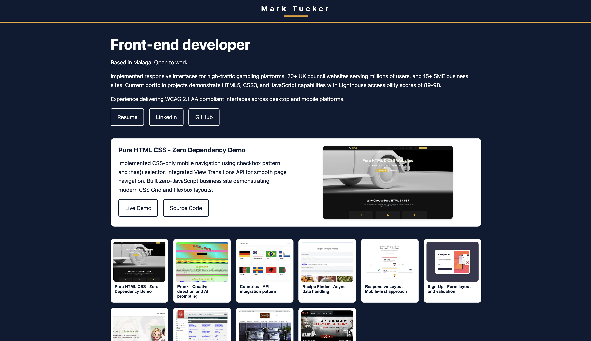

# Mark Tucker - Portfolio

A clean, responsive portfolio website showcasing my web development projects and skills. I'm also interested in technical writing and content design, check the repo of my [content design portfolio](https://github.com/mrkteq/content-designer).

**[View Live Demo](https://marktucker-portfolio.netlify.app/)**

## Tech Stack

- **HTML5** - Semantic markup with custom web components
- **CSS3** - Modern responsive design with CSS Grid and Flexbox
- **Vanilla JavaScript** - Custom animated logo component
- **Sharp** - Automated responsive image generation

## Features

- Animated SVG logo with customizable timing
- Fully responsive design across all devices
- Dark mode support
- Accessibility-focused (semantic HTML, ARIA labels)
- Optimized responsive images with automated pipeline
- Fast loading with minimal JavaScript

## Development

### Responsive Image Pipeline

This repo includes a simple image pipeline to generate responsive assets and a JSON map consumed by the site.

1. Place original images in `img/` named as `project-<slug>.jpg`.
2. Install dependencies and run the build:
   - `npm install`
   - `npm run build:images`
3. Optimised versions are generated in `img/optimized/<slug>/` and a map is written to `js/images-map.json` and used automatically by the site.

No changes to the HTML are required; the grid and featured image will use `srcset`/`sizes` when the map is present.
